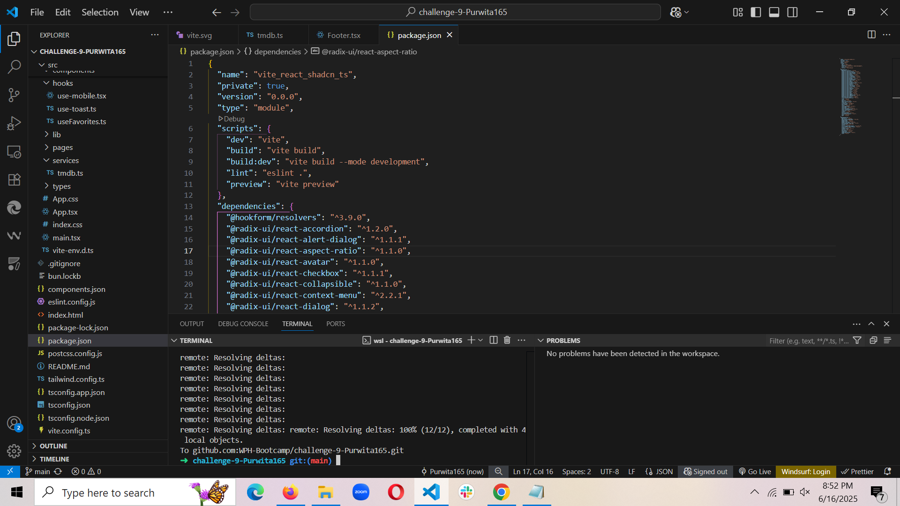

# mpv-todolist-frontend

A modern, production-ready Todo List application built with Next.js and shadcn/ui.

## 🛠 Tech Stack

- **Framework**: Next.js 14 (App Router), React 18, TypeScript
- **Styling**: Tailwind CSS, tailwindcss-animate, shadcn/ui
- **State**: Redux Toolkit, @tanstack/react-query
- **Forms**: React Hook Form, Zod
- **Components**: Radix UI, Lucide React, react-resizable-panels
- **Deployment**: Vercel
- **Package Manager**: pnpm

## 🚀 Live Demo
[View Live →](https://mpv-todolist-frontend.vercel.app)

## 📸 Screenshot
